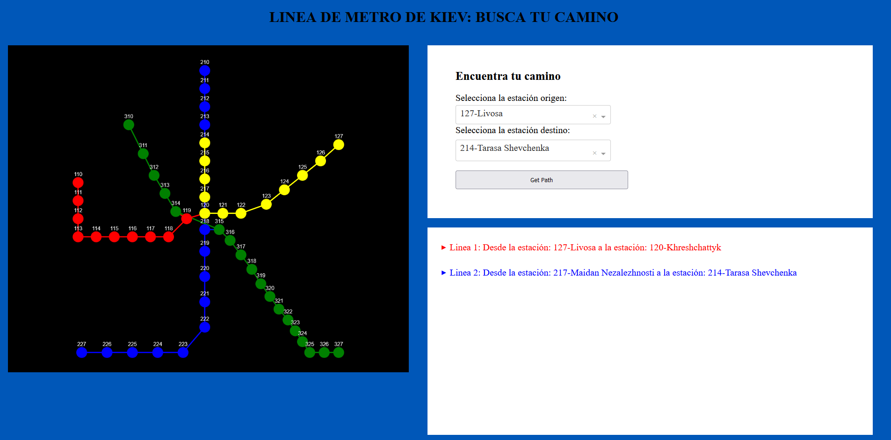

# Metro-Kiev-IA-Group8
Se desea moverse por la red de metro de Kiev, pero no conoces las paradas que debes tomar y cuando debes o no cambiar de linea. 

Con esta app, será posible realizar la ruta más optima entre una estación a otra con un viaje de mínima duración.


## Uso / Acceso a la aplicación.

Para ejecutar el código de esta aplicación, se necesitaria descarga varias librearias de python.
Pruebe a ejecutar para instalar de manera automática lo necesario:
````
pip install -r requirements.txt
````
Se puede acceder a la aplicación, si descargar el repositorio o ejecutarlo en el siguiente enlace.
La aplicación está desplegada en la plataforma de [Heroku](www.heroku.com).
Enlace de Uso: https://github.com/RubenCid35/Metro-Kiev-IA-Group8.git


## Documentación
Para facilitar la compresión y entendimiento de las partes de esta aplicación, se ha facilitado una documentación de Github
en la que se exponen las partes de este proyecto. Se puede acceder a la documentación a través del siguiente link:

https://documentacionai.gitbook.io/optimizador-de-rutas-para-transporte-grupo-8/

## Diseño de la APP
La aplicación fue creada utilizando un dashborad. En ella se puede usar el grafo con las estaciones de metro para
seleccionar las estaciones de salida y entrada.



=======
## Colaboradores
Los autores de esta aplicación son:
- Rubén Cid.
- Rodrigo Duran Andres.
- Luis Nuñez.
- Pedro Ortiz.
